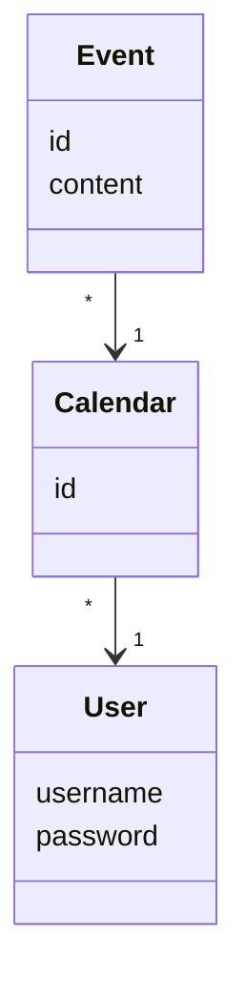

# Arkkitehtuurikuvaus

## Rakenne
Ohjelman koodin perusrakenne toimii seuraavasti: Pakkauksessa _ui_ oleva koodi vastaa käyttöliittymästä, _services_ sovelluslogiikasta ja _repositories_ tietojen tallennuksesta. _entities_ puolestaan sisältää sovelluksen käyttämiä tietokohteita kuvastavia luokkia.

## Käyttöliittymä
Käyttölittymä sisältää kolme erillistä näkymää:

* Uuden käyttäjätilin luominen
* Kirjautuminen
* Kalenterinäkymä

Jokainen näkymä on toteutettu omaan luokkaan. Yksi näkymistä on aina kerrallaan näkyvänä. Näkymien näyttämisestä, vaihtamisesta ja poistamisesta vastaa [UI](../src/ui/ui.py)-luokka. Käyttöliittymä on pyritty eristämään sovelluslogiikasta mahdollisimman paljon.

## Sovelluslogiikka

Sovelluksen tietomallin muodostavat luokat [User](../src/entities/user.py), [Calendar](../src/entities/calendar.py) ja [Event](../src/entities//event.py). Luokat kuvaavat käyttäjiä, käyttäjän kalenteria ja kalenteriin lisättäviä tapahtumia:


Luokka [CalendarService](../src/services/calendar_service.py) vastaa ohjelman toiminnallisista kokonaisuuksista. Luokka tarjoaa jokaiselle sisältämälleen käyttäjäliittymän toiminnolle oman metodin, joita ovat esim.

* create_user(username, password)
* login(username, password)
* create_calendar()

Kalenteriin lisättävien tapahtumien hallinta on eristetty omalle luokalleen [EventService](../src/services/event_service.py). Luokka tarjoaa mm. seuraavia metodeja:

* create_event(content, date)
* get_events()

Molemmat luokat pääsevät käsiksi käyttäjä- ja kalenteritietoihin tietojen tallentamisesta vastaavien luokkien [UserRepository](../src/repositories/user_repository.py), [CalendarRepository](../src/repositories/calendar_repository.py) ja [EventRepository](../src/repositories/event_repository.py) avulla. Luokkien toteutuksen injektoidaan sovelluslogiikasta vastaavaan koodiin konstruktorikutsun yhteydessä. 

## Tietojen tallennus
Pakkauksen _repositories_ sisältämät luokat ```UserRepository```, ```CalendarRepository``` ja ```EventRepository``` vastaavat tietojen pysyvästä tallentamisesta. Luokat ```CalendarRepository``` ja ```EventRepository``` tallentavat tiedot CSV-tiedostoon, kun taas ```UserRepository``` puolestaan SQLite-tietokantaan. Luokkia on tarpeen vaatiessa mahdollista uusilla toteutuksilla, jos tallennustapoja pitää vaihtaa. Testauksessa käytetään tiedostoon ja tietokantaan tallentavien olioiden sijaan keskusmuistiin tallentavia toteutuksia.

## Tiedostot
Sovellus tallettaa käyttäjien ja kalenterien tiedot erillisiin tiedostoihin. Sovelluksen juuressa sijaitseva konfiguraatiotiedosto [.env](/.env) määrittelee tiedostojen nimet.

CSV-tiedostoihin tiedot tallennetaan seuraavissa formaateissa:
1. calendar.csv:
```
1f3e111a-b2cb-4b86-9787-c1ab1ced4cde;username1
0b84df0c-bc62-427d-9894-56f223d600a1;username2
```


<!--  -->
<!--  -->