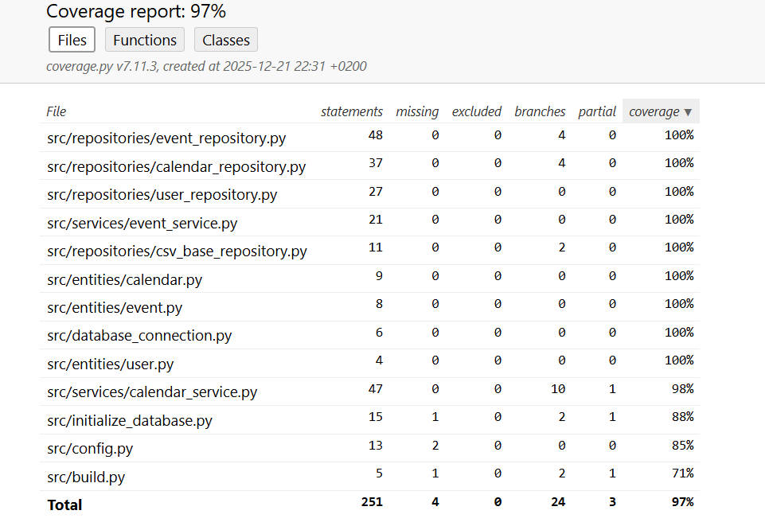

# Testausdokumentti
Ohjelman testaus on toteutettu automatisoitujen yksikkötestien avulla unittestilla. Sen lisäksi on toteutettu manuaalisia järjestelmätason testejä.

## Yksikkötestaus
### Sovelluslogiikka
Sovelluslogiikasta vastaavia luokkia `CalendarService` ja `EventService` testataan testiluokilla [TestCalendarService](../src/tests/services/calendar_service_test.py) ja [TestEventService](../src/tests/services/event_service_test.py). Testauksessa luokille injektoidaan repositorio-oliot, jotka tallentavat tietoa muistiin pysyvän tallennuksen sijaan. Tähän tarkoitukseen on luotu luokat `FakeUserRepository`, `FakeCalendarRepository` ja `FakeEventRepository`. 

### Repositoriot
Repositoriot `CalendarRepository`, `UserRepository` ja `EventRepository` testataan testeissä käytössäolevilla tiedostoilla, joiden nimet on konfiguroitu _.env.test_-tiedostoon. Luokkia testataan testiluokilla [TestCalendarRepository](../src/tests/repositories/calendar_repository_test.py), [TestUserRepository](../src/tests/repositories/user_repository_test.py) ja [TestEventRepository](../src/tests/repositories/event_repository_test.py).

### Testauskattavuus
Testauksesta jätettyä käyttöliittymäkerrosta lukuunottamatta sovelluksen testauksen haarautumakattavuus on 97%.

Testaamatta jäivät mm. _build.py_- ha _initialize_database.py_-tiedostojen suorittaminen komentoriviltä.

## Järjestelmätestaus
Sovelluksen järjestelmätestaus suoritettiin manuaalisesti.

### Asennus ja konfigurointi
Sovellus on haettu ja sitä on testattu [käyttöohjeen](../dokumentaatio/kayttoohje.md) kuvaamalla tavalla WSL-ympäristössä. Sovellusta on testattu tilanteissa, jolloin käyttäjät kalentereineen ovat ollut jo olemassa ja joissa eivät ole ollut. Jälkimmäisessä tilanteessa ohjelma on luonut ne itse.

### Toiminnallisuudet
Kaikki [vaatimusmäärittelyn](../dokumentaatio/vaatimusmaarittely.md) ja käyttöohjeen listaamat toiminnallisuudet on testattu ja todettu toimiviksi.

## Sovellukseen jääneet laatuongelmat
Sovellusta ei ole mielekästä käyttää kokonäyttötilassa, sillä kalenteri skaalautuu silloin omituisesti. 