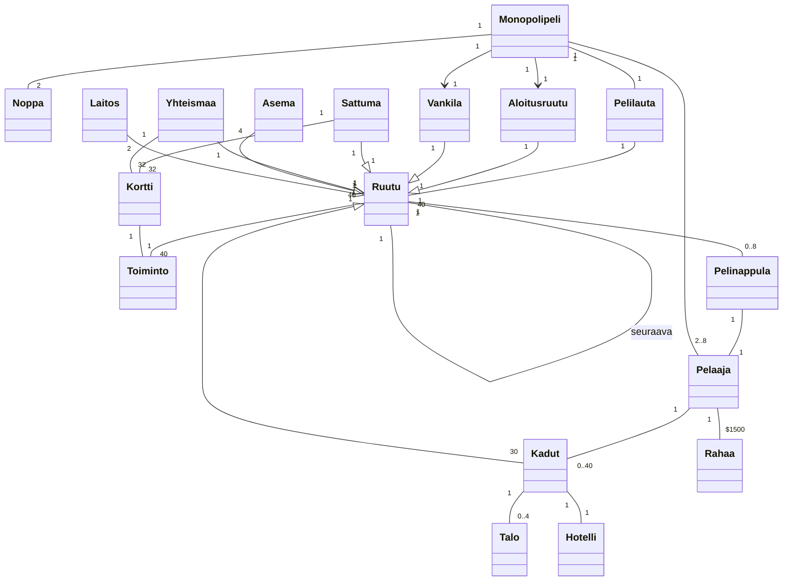

## Monopoli, alustava luokkakaavio

```mermaid
 classDiagram
    Monopolipeli "1" -- "2" Noppa
    Monopolipeli "1" -- "1" Pelilauta
    Monopolipeli "1" --> "1" Aloitusruutu
    Monopolipeli "1" --> "1" Vankila
    Pelilauta "1" -- "40" Ruutu
    Ruutu "40" -- "40" Toiminto
    Sattuma "1" -- "32" Kortti
    Yhteismaa "1" -- "32" Kortti
    Kortti "1" -- "1" Toiminto
    Aloitusruutu "1" --|>"1" Ruutu
    Vankila "1" --|> "1" Ruutu
    Sattuma "1" --|> "1" Ruutu
    Yhteismaa "1" --|> "1" Ruutu
    Asema "4" --|> "1" Ruutu
    Laitos "2" --|> "1" Ruutu
    Kadut "30" --|> "1" Ruutu
    Kadut "1" -- "0..4" Talo
    Kadut "1" -- "1" Hotelli
    Ruutu "1" -- "1" Ruutu : seuraava
    Ruutu "1" -- "0..8" Pelinappula
    Pelinappula "1" -- "1" Pelaaja
    Pelaaja "1" -- "0..40" Kadut
    Pelaaja "1" -- "$1500" Rahaa
    Pelaaja "2..8" -- "1" Monopolipeli
```